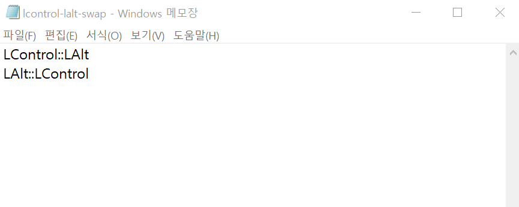
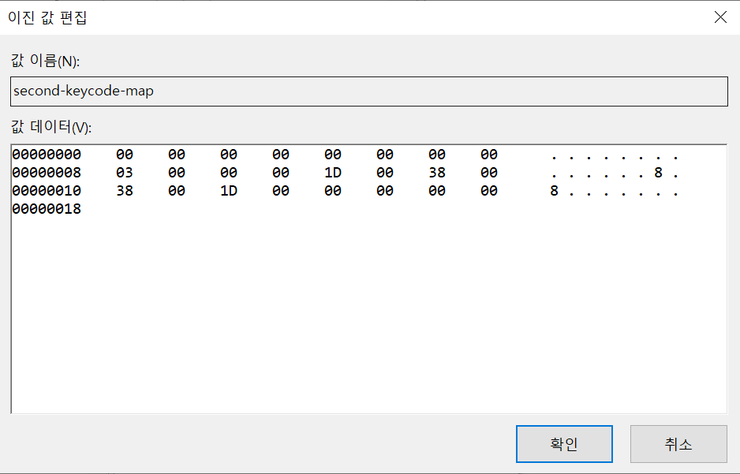

# 윈도우 control, alt 키 위치 바꾸기

전전 직장에서부터 지금 회사까지 회사 업무용으로 Mac OS를 사용해왔다. 그러면서 회사 컴과 내 컴과의 키 조절이 힘들어졌다. 내 컴은 윈도우 컴퓨터다. 윈도우 OS를 선택하게 된 이유는 맥OS 에서 탈출하고 싶은 마음도 있고, Mac OS는 어차피 이제는 이직을 해도 회사 업무용으로 사용하는 경우가 많아서 굳이 개인 용으로 사야 되나 싶은 마음이 들었다. 그래서 윈도우 OS를 샀다.

막상 사고나서 매번 헷갈리는게 키 매핑이다. control 키가 이제는 불편해졌다. 리눅스도 control 를 자주 쓰는거라 이건 Mac OS 사용하는 특수한 증상이다. 그래서 키 매핑을 바꿔야 겠다는 생각에 도달했다...

이거 하면서 아.. 윈도우 이럴 뻔 했는데 생각해보니 MacOS도 생각해보니 예전 기억으로는 구동 스크립트같은거 만든거 기억났다. 운영체제 빨이 아니다. 그냥 쓰고싶은 OS 쓰면서 적응하면 되는 거다. 어차피 거의 다 비슷함.

## Solution

### window 10

#### 참고자료

- [Window 10 에서 키를 다시 매핑하는 방법](https://genuine-lamps.com/ko/windows/16053-how-to-remap-keys-on-windows-10.html)
- [AutoHotKey 로 윈도우 기본 단축키 변경](https://seroro.tistory.com/16)
- [AutoHotKey Syntax](http://xahlee.info/mswin/autohotkey_key_notations.html)

#### 해결해보까

[autohotkey](https://www.autohotkey.com/) 라는 사이트를 방문해서 설치 파일을 다운받아서 설치!!!

이렇게 다운 받아놓았으면, 확장자가 `*.ahk` 인 파일을 만들어서 `시작프로그램` 폴더에 넣어두면 윈도우가 시작할 때마다 키 매핑이 적용된다.

`*.ahk` 인 파일은 보통 키매핑 스크립트라고 부르는 듯 하다. 

내 경우는 컨트롤, 알트 키를 바꾸는게 목적이어서 아래와 같이 작성하고 시작프로그램폴더에 lcontrol-lalt-swap.ahk 라는 이름으로 복사해두었다.

**`lcontrol-lalt-swap.ahk` 파일 내용**

**시작 프로그램 폴더에 복사**

### window 7,8

> window 10 이라 이 방법을 썼는데 안됐다...ㅋㅋㅋ

#### 참고자료

[WINDOW 7 에서 왼쪽 ALT 키와 CTRL 키 바꾸기](http://todactodac.blogspot.com/2014/11/window-window7-alt-ctrl.html)

#### 해결해보까

window + R 키 > regedit

레지스트리 에딧!!!

 

`HKEY_LOCAL_MACHINE > SYSTEM > CurrentControlSet > Control > Keyboard Layout` 

마우스 우클릭 > 새로 만들기 > 이진값

레지스트리의 이름을 알아볼 수 있는 이름으로 변경 

키맵을 아래와 같이 변경

재부팅

