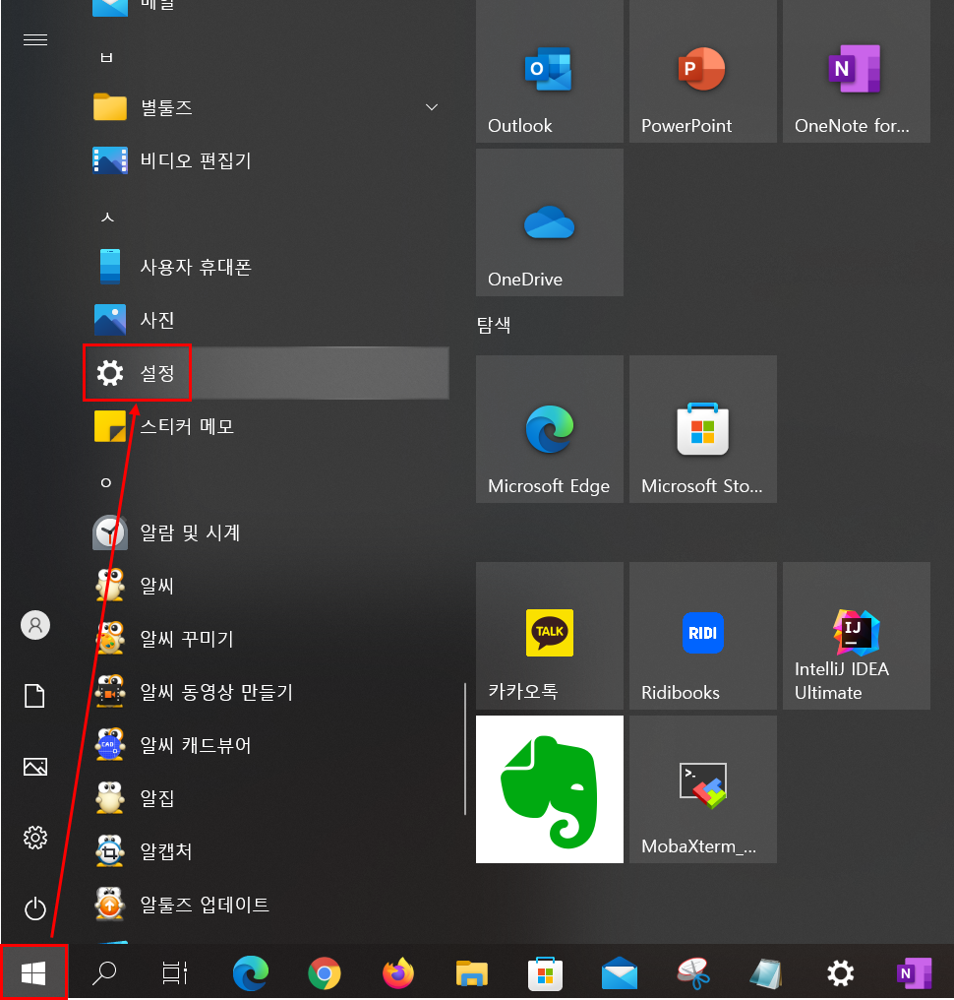
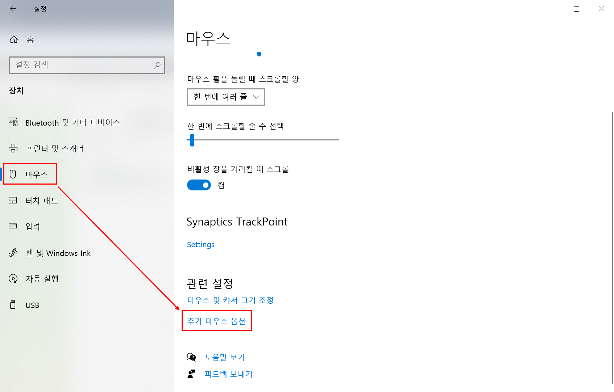
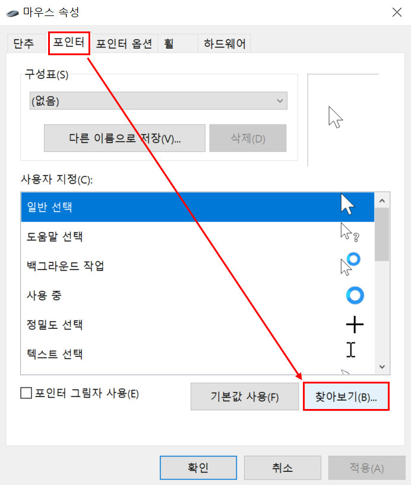
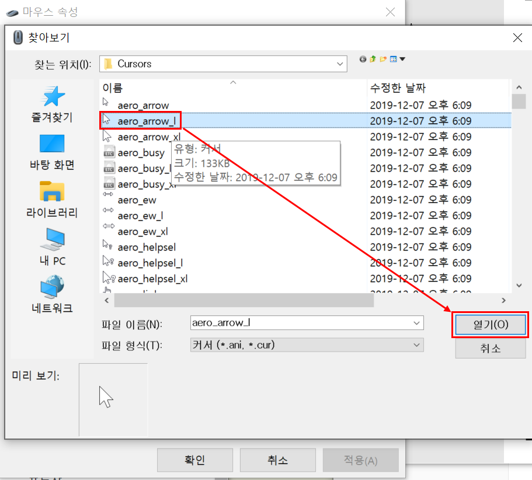
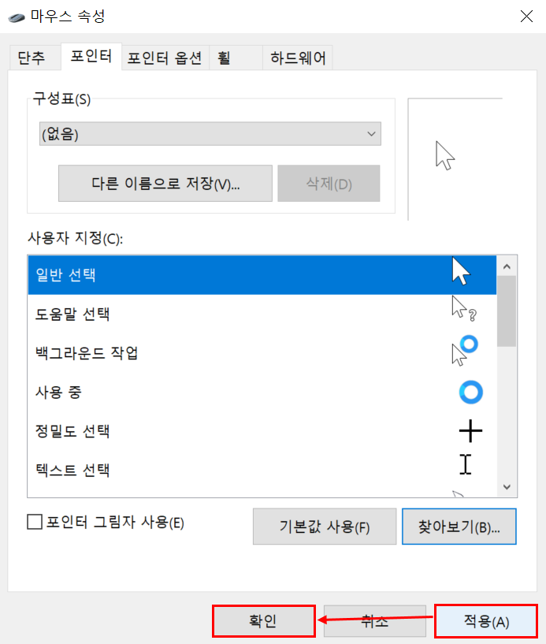

# 윈도우 마우스 포인터 사라질때

윈도우10 을 4년? 만에 처음으로 다시 사용해보면서 너무 좋았었다. 하지만 업데이트를 하고나서 항상 마우스 포인터가 보이질 않았다. 그래서 그냥 껐다 킨적이 많았다. 이번 문서에서는 윈도우 마우스 포인터 사라질 때에 대한 해결방법들을 정리해보려고 한다. 

 

일단 마우스 포인터가 보이지 않는 이유는 여러가지가 있다. 내 경우는 마우스 포인터의 스타일일 `aero_arrow_l` 로 지정해주면 되는 문제였다. 오늘은 만사 다 귀찮고 해서 여러가지 해결 방법중 이 aero_arrow_1 을 지정하는 방식만 정리할거다.ㅋㅋ 

 

## 참고자료

- [streetseen.tistory.com - 화면에서 마우스 커서 사라짐 현상 해결법](https://streetseen.tistory.com/entry/%EB%A7%88%EC%9A%B0%EC%8A%A4-%EC%BB%A4%EC%84%9C-%EC%82%AC%EB%9D%BC%EC%A7%90-%ED%98%84%EC%83%81)

 

## 브라우저 윈도우 10 `aero_arrow_l` 적용방법

윈도우 업데이트 과정에서 자주 발생하는 문제라고 한다. 

윈도우버튼 -> [설정] 버튼 클릭

> 알캡처를 얼마 전에 깔았다. 4년 전쯤 중소기업에서 일할때 프로젝트 완료 보고서, 사용자 매뉴얼을 개발자 본인이 모두 작성해야 했다. 캡처 작업도 많고 글써야 하는 작업도 많았는데, 이때 알캡처 덕에 굉장히 미친속도로 문서작업을 완료했었다. 각 문서당 200 페이지 분량이었다. 역시 윈도우는 노동자의 OS다.

 

[설정] 창에서는 아래와 같이 선택해준다.

[마우스] > [추가 마우스 옵션]

 

[마우스 속성]창이다.

- [포인터] 탭 클릭 > [찾아보기 (B) ...] 클릭

 

[찾아보기] 창에서는 아래와 같이 선택하자

- [aero_arrow_1] 선택 > [열기]

 

[적용] 버튼 클릭 > [확인] 버튼 클릭

