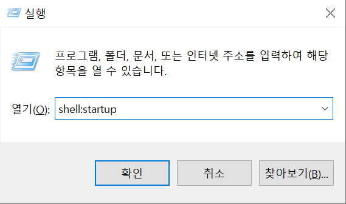
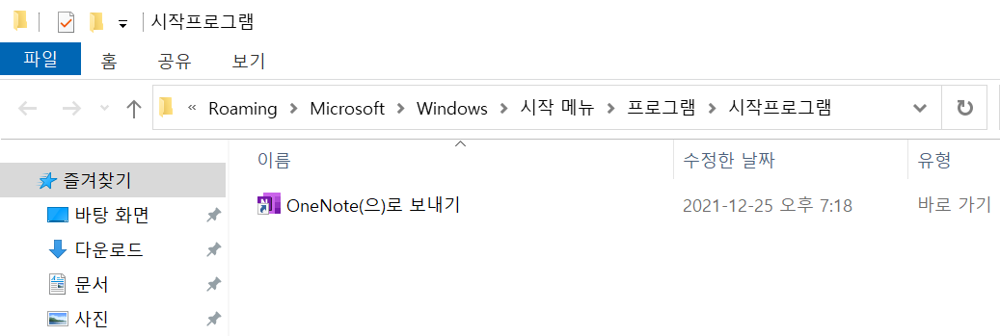

# 윈도우에서 시작 프로그램 폴더 찾기

## 참고자료 

- [윈도우 10 시작 프로그램 폴더 위치 찾기](https://www.dukgun.com/2019/08/Find-the-Windows10-Startup-folder-location.html)

## solution...

### 1) 단축키 이용

window + r > shell:startup

이렇게 하면 아래와 같이 디렉터리가 나타난다!!! 하하하

### 2) 물리 경로로 접근

물리경로도 알아 두어야 나중에 필요할 때 사용할 수 있다.

물리경로는 이런 규칙으로 되어 있다. 나중에 사용해보자...

`C:\Users\[사용자명]\AppData\Roaming\Microsoft\Windows\Start Menu\Programs\Startup` 

