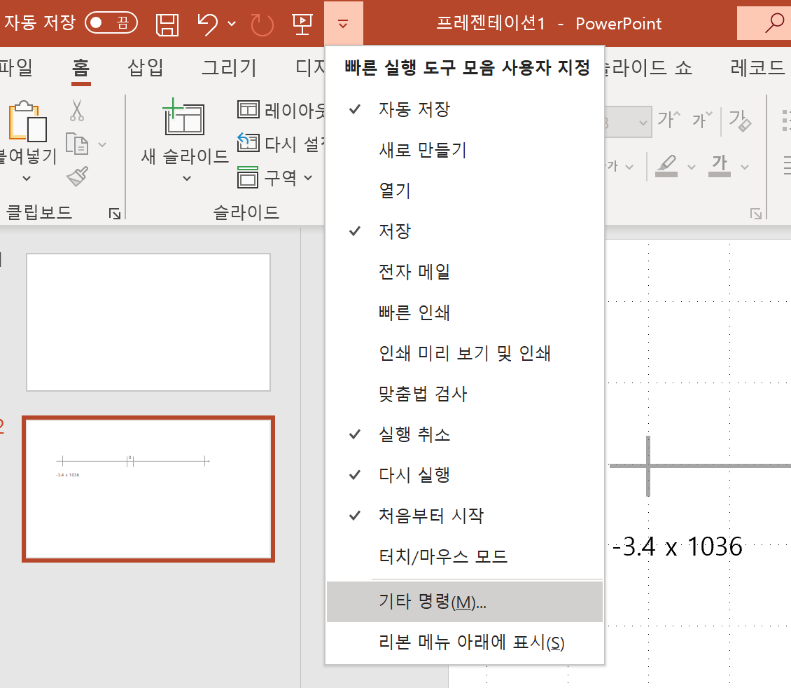
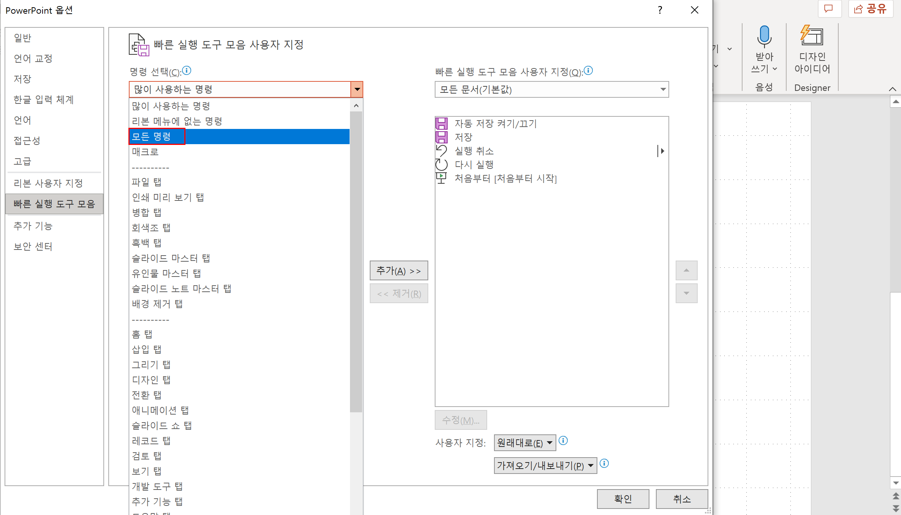
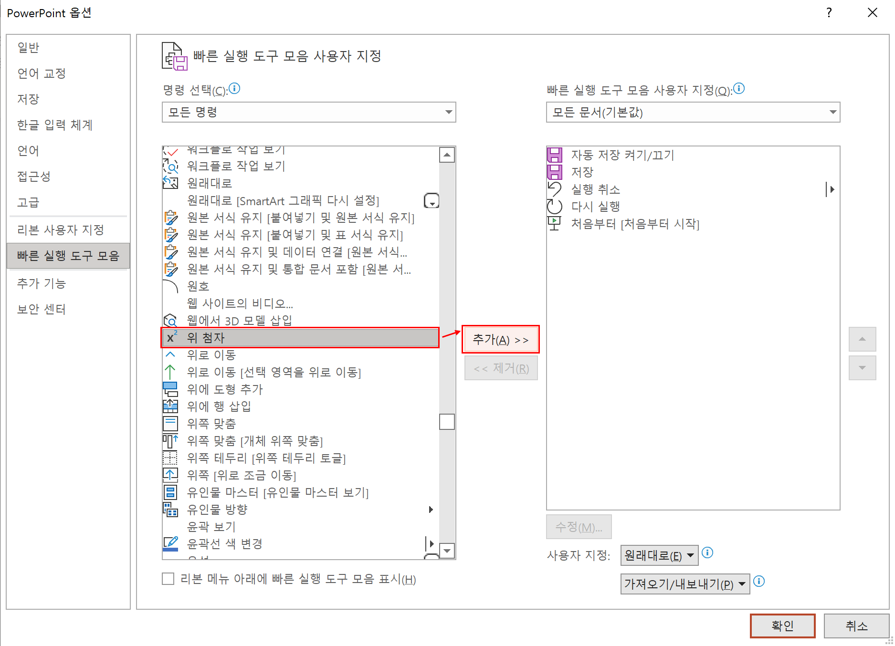
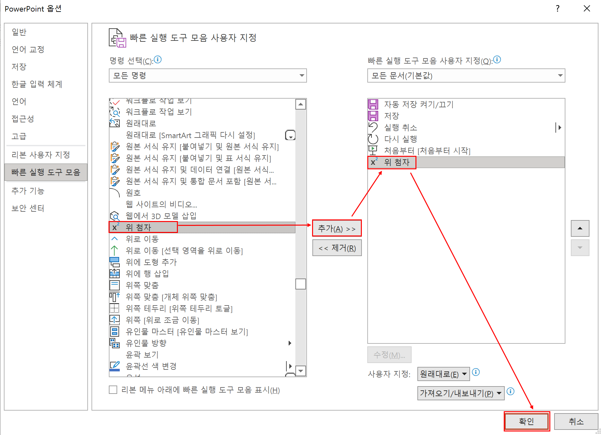
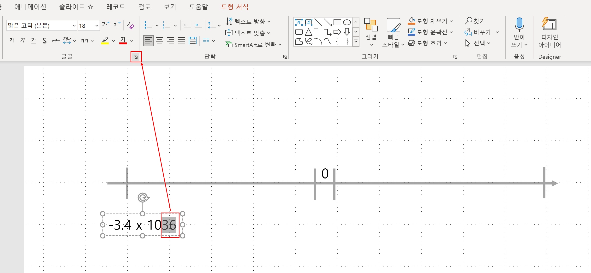
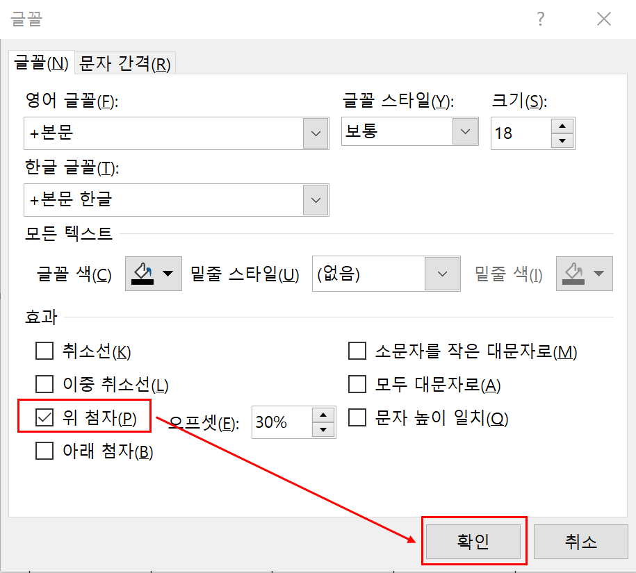
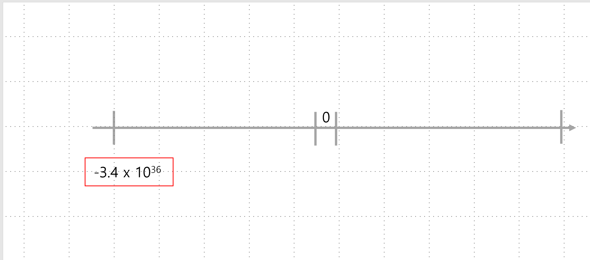

# 파워포인트 - 제곱 표시하기

참고한자료 : [파워포인트 위첨자 및 제곱미터 표시하기](https://m.blog.naver.com/PostView.naver?isHttpsRedirect=true&blogId=place86&logNo=220849635228) 

 

일단은 시간이 없어서 그림들의 경로들만을 모두 표시해두고 점심시간 내지 저녁 or 내일 추가로 수정할 예정

 

 

 

 

 

 

